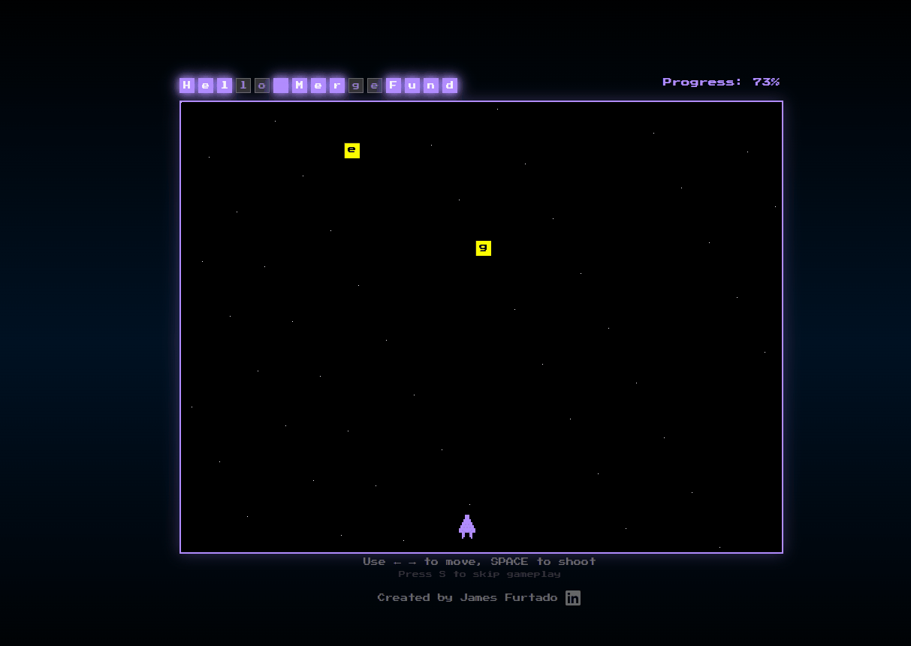

# Hello MergeFund! - Space Invaders Submission

**Built for the MergeFund "Hello MergeFund" challenge.**

A retro browser game where you shoot down letters to spell "Hello MergeFund". Winners get a firework display!

## 🛠️ Tech Stack
- HTML, CSS, JavaScript (no frameworks)
- HTML5 Canvas for the game and fireworks
- Web Audio API for sound effects

## ▶️ How to Run
1. Download or clone this repo.
2. Open `index.html` in your browser. *All done!*

## 💡 Creative Approach
- I chose to mimic the classic arcade shooter game, "Space Invaders".
    - I tried to preserve the "retro" feel as best as possible, by using pixel graphics and synth sound effects.
- I wanted to emphasize the celebration of MergeFund's launch with an energetic win screen.

## ✍️ Author's Note
Special thanks to all of those working to make MergeFund possible!

James David Furtado

