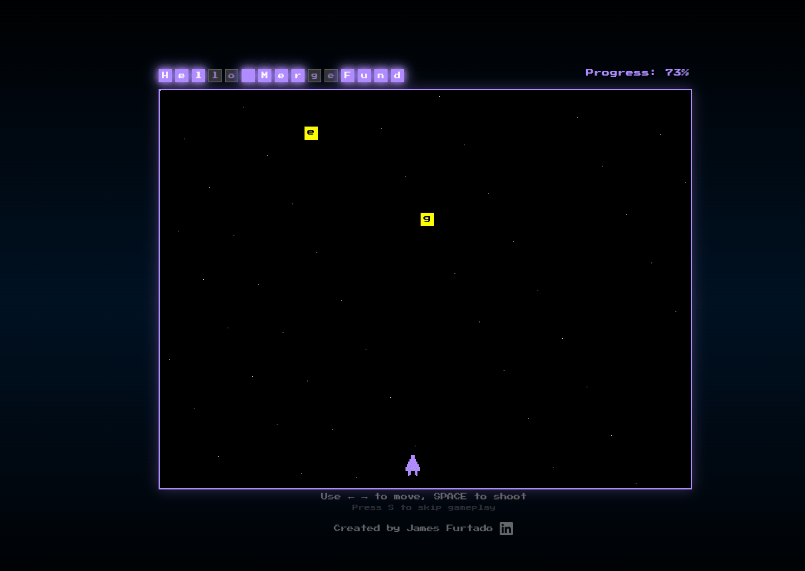

# Hello MergeFund! - James Furtado Submission

**Built for the MergeFund's "Hello MergeFund" challenge.**

Play it here! https://jamesdfurtado.github.io/hello-mergefund/

*[MergeFund](https://mergefund.org) is a new website that incentivizes developers to make open source contributions by paying those who submit successful PRs to issues.*

For MergeFund's launch, they held a contest for users to submit their most creative "Hello World" program!

* My submission was a retro browser game where you shoot down letters to spell "Hello MergeFund". Winners get a firework display!

## Tech Stack
- HTML, CSS, JavaScript (no frameworks)
- HTML5 Canvas for the game and fireworks
- Web Audio API for sound effects

Special thanks to all of those working to make MergeFund possible!

---

James David Furtado

